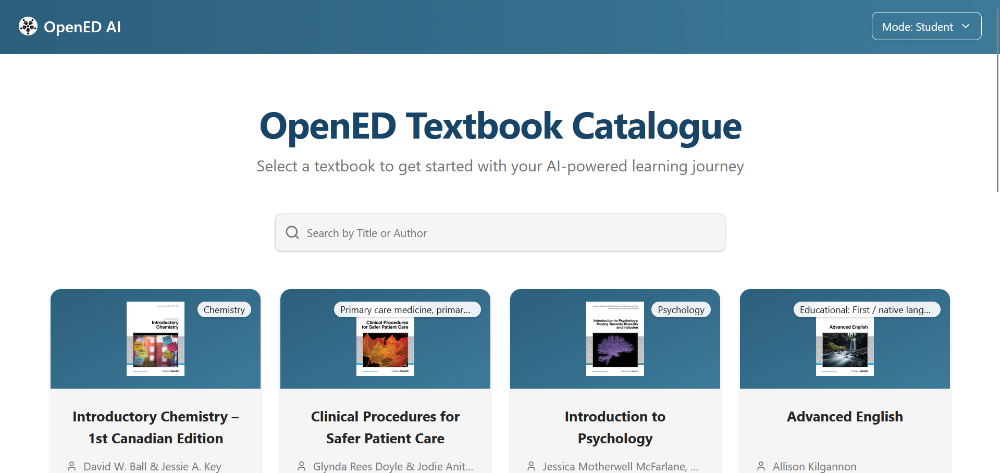

# User Guide

**Before you start:** confirm the app is deployed using the deployment guide at `Docs/DEPLOYMENT_GUIDE.md`.

This document summarizes the main user flows, UI controls, and administrative actions in the Specialization Explorer frontend. It reflects the current UI and behavior implemented in the frontend code (chat, prompts, practice generation, audio, and admin features).

| Index    | Description |
| -------- | ------- |
| [Getting Started](#getting-started) | Create an account and get started with the app |
| [Student View](#student-view) | Browse textbooks, use the Chat interface, and generate practice materials |
| [Administrator View](#administrator-view) | Admin dashboards: ingestion, moderation, AI settings, analytics |

---

## Getting Started

1. Open the hosted site (Amplify URL provided in the deployment process) or run the frontend locally.
---

## Student View

---

## Administrator View

Switch to Instructor mode via the Mode selector (top header). Instructors have access to the Material Editor and additional tools.

## Additional Resources

- [Deployment Guide](./DEPLOYMENT_GUIDE.md)
- [Architecture Documentation](./ARCHITECTURE.md)
- [API Documentation](./API_DOCUMENTATION.pdf)