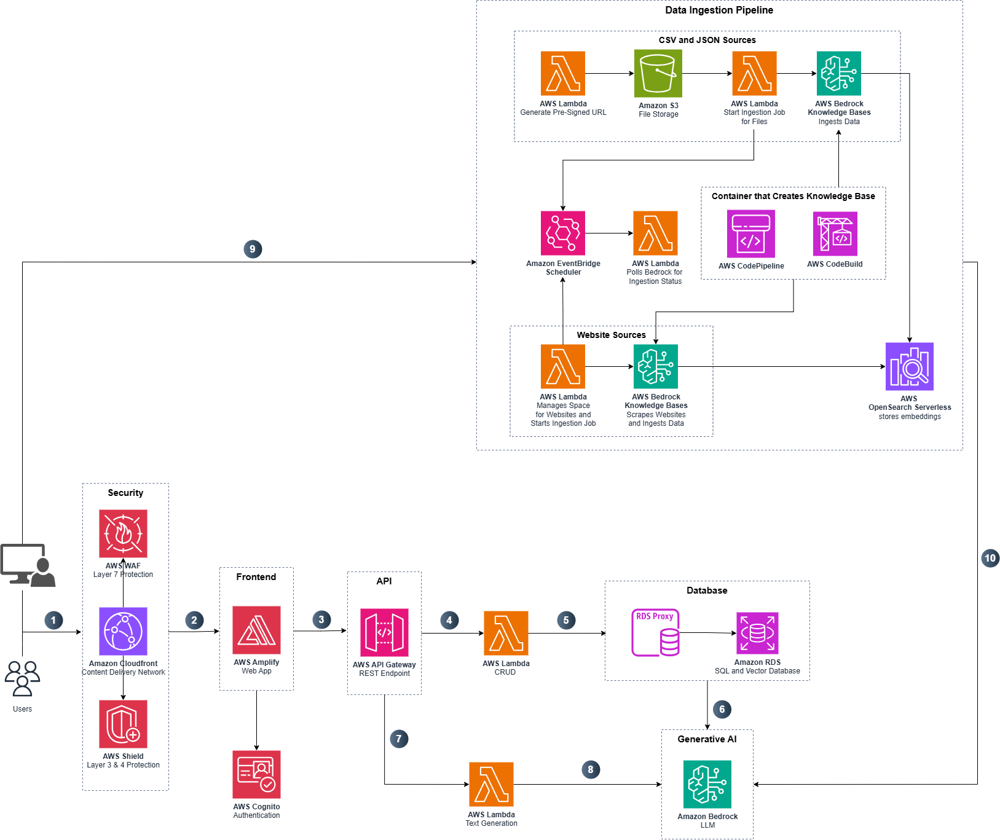

# Specialization Explorer

update this later

| Index                                                 | Description                                             |
| :---------------------------------------------------- | :------------------------------------------------------ |
| [High Level Architecture](#high-level-architecture)   | High level overview illustrating component interactions |
| [Deployment](#deployment-guide)                       | How to deploy the project                               |
| [User Guide](#user-guide)                             | The working solution                                    |
| [Directories](#directories)                           | General project directory structure                     |
| [Database Schema](#database-schema)                   | Database schema visualization                           |
| [Additional Documentation](#additional-documentation) | Comprehensive guides and references                     |
| [Credits](#credits)                                   | Meet the team behind the solution                       |
| [License](#license)                                   | License details                                         |

## High-Level Architecture

The following architecture diagram illustrates the various AWS components utilized to deliver the solution. For an in-depth explanation of the frontend and backend stacks, please look at the [Architecture Deep Dive](Docs/ARCHITECTURE_DEEP_DIVE.md).



## Deployment Guide

To deploy this solution, please follow the steps laid out in the [Deployment Guide](Docs/DEPLOYMENT_GUIDE.md)

## User Guide

Please refer to the [Web App User Guide](Docs/USER_GUIDE.md) for instructions on navigating the web app interface.

## Directories

```
├── cdk/
│   ├── bin/
│   ├── lambda/
│   │   ├── adminAuthorizerFunction/
│   │   ├── authorization/
│   │   ├── config/
│   │   ├── csvProcessor/
│   │   ├── dataIngestion/
│   │   ├── db_setup/
│   │   │   └── migrations/
│   │   ├── generatePresignedURL/
│   │   ├── h5pExport/
│   │   ├── handlers/
│   │   ├── jobProcessor/
│   │   ├── mediaJobProcessor/
│   │   ├── practiceMaterial/
│   │   ├── publicTokenFunction/
│   │   ├── textGeneration/
│   │   └── websocket/
│   ├── lib/
│   │   ├── amplify-stack.ts
│   │   ├── api-stack.ts
│   │   ├── cicd-stack.ts
│   │   ├── database-stack.ts
│   │   ├── dbFlow-stack.ts
│   │   └── vpc-stack.ts
│   └── OpenAPI_Swagger_Definition.yaml

├── Docs/
│   ├── media/
│   ├── API_DOCUMENTATION.pdf/
│   ├── USER_GUIDE.md
│   ├── ARCHITECTURE_DEEP_DIVE.md
│   ├── BEDROCK_GUARDRAILS.md
│   ├── DATABASE_MIGRATIONS.md
│   ├── DEPENDENCY_MANAGEMENT.md
│   ├── MODIFICATION_GUIDE.md
│   └── DEPLOYMENT_GUIDE.md

├── frontend/
│   ├── public/
│   └── src/
│       ├── assets/
│       ├── components/
│       │   ├── Admin/
│       │   ├── ChatInterface/
│       │   ├── HomePage/
│       │   ├── ui/
│       │   ├── Footer.tsx
│       │   ├── Header.tsx
│       │   ├── HomePageHeader.tsx
│       │   └── ProtectedRoute.tsx
│       ├── contexts/
│       ├── functions/
│       ├── hooks/
│       ├── layouts/
│       ├── lib/
│       ├── pages/
│       │   ├── Admin/
│       │   ├── ChatInterface/
│       │   ├── FAQ/
│       │   ├── MaterialEditor/
│       │   ├── PracticeMaterial/
│       │   ├── HomePage.tsx
│       │   └── UserGuidelines.tsx
│       ├── providers/
│       ├── types/
│       ├── utils/
│       ├── App.tsx
│       ├── index.css
│       └── main.tsx
```

1. `/cdk`: Contains the deployment code for the app's AWS infrastructure
   - `/bin`: Contains the instantiation of CDK stacks
   - `/lambda`: Contains the Lambda functions for data ingestion, text generation, practice material generation, and other core functionalities
     - `/adminAuthorizerFunction`: Admin authentication and authorization
     - `/authorization`: User authorization logic
     - `/config`: Configuration management (welcome messages, system settings)
     - `/db_setup`: Database migrations and schema definitions
     - `/generatePresignedURL`: S3 presigned URL generation for file uploads
     - `/h5pExport`: H5P interactive content export functionality
     - `/handlers`: API handlers for admin, chat, FAQ, and analytics operations
     - `/practiceMaterial`: Generates practice questions, flashcards, and quizzes
     - `/publicTokenFunction`: Public token generation for unauthenticated access
     - `/textGeneration`: RAG-based conversational AI using Amazon Bedrock
     - `/websocket`: WebSocket connection handlers for real-time chat
   - `/lib`: Contains the CDK stack definitions
     - `amplify-stack.ts`: AWS Amplify frontend hosting
     - `api-stack.ts`: API Gateway, Lambda functions, and WebSocket APIs
     - `cicd-stack.ts`: CI/CD pipeline configuration
     - `database-stack.ts`: RDS PostgreSQL with pgvector extension
     - `dbFlow-stack.ts`: Database migration management
     - `vpc-stack.ts`: VPC, subnets, and networking configuration
   - `OpenAPI_Swagger_Definition.yaml`: API specification for the Specialization Explorer service
2. `/Docs`: Contains comprehensive documentation for the application
   - `DEPLOYMENT_GUIDE.md`: Step-by-step deployment instructions
   - `USER_GUIDE.md` : Complete overview on how to use the application
   - `ARCHITECTURE_DEEP_DIVE.md` : Detailed explanation of the backend is built.
   - `BEDROCK_GUARDRAILS.md` : Explanation of what guardrails are and how to change them.
   - `DATABASE_MIGRATIONS.md` : Explanation on how to modify the database.
   - `DEPENDENCY_MANAGEMENT.md` : Documentation on how python dependencies are locked and managed.
   - `MODIFICATION_GUIDE.md` : Documentation on how to modify components of the frontend such as colours, text and licensing information.
   - `API_DOCUMENTATION.pdf` : Documentation of all API endpoints
3. `/frontend`: Contains the React + TypeScript user interface
   - `/src/assets`: Static assets (images, icons, etc.)
   - `/src/components`: Reusable UI components
     - `/Admin`: Admin dashboard components
     - `/ChatInterface`: Chat UI and message components
     - `/HomePage`: Landing page components
     - `/ui`: shadcn/ui base components (buttons, dialogs, cards, etc.)
   - `/src/contexts`: Legacy React contexts for state management
   - `/src/functions`: Helper functions and business logic
   - `/src/hooks`: Custom React hooks (useWebSocket, etc.)
   - `/src/layouts`: Page layout components (TextbookLayout, etc.)
   - `/src/lib`: Utility functions and API clients
   - `/src/pages`: Main application pages and routes
     - `/Admin`: Admin dashboard pages (login, textbook management, analytics)
     - `/ChatInterface`: Chat interface page
     - `/FAQ`: FAQ page
     - `/MaterialEditor`: Material editor page
     - `/PracticeMaterial`: Practice material generation page
   - `/src/providers`: React Context providers (ModeProvider, UserSessionProvider, SidebarProvider, TextbookViewProvider)
   - `/src/types`: TypeScript type definitions
   - `/src/utils`: Utility functions (PDF export, etc.)

## Database Schema

The application uses PostgreSQL with the pgvector extension for semantic search capabilities. The database schema includes tables for:

- **Core Content**: Users, textbooks, sections, media items, document chunks, and embeddings
- **Sessions & Interactions**: User sessions, chat sessions, and message history
- **Prompts & FAQ**: Prompt templates, guided prompts, shared prompts, and FAQ cache
- **Jobs & Analytics**: Ingestion jobs, analytics events, and practice material tracking
- **System Configuration**: System settings and configuration

For a detailed visualization of the database schema, see the [DBML schema file](cdk/lambda/db_setup/schema.dbml). You can visualize this schema at [dbdiagram.io](https://dbdiagram.io).


## Key Features

### For Students

- **Conversational AI Tutor**: Ask questions about textbook content and receive guided, Socratic-style responses
- **Practice Material Generation**: Generate multiple-choice questions, flashcards, and short-answer questions
- **Multi-Textbook Support**: Access multiple textbooks within a single interface
- **Session Management**: Save and resume chat sessions across devices
- **Text-to-Speech**: Listen to AI responses with built-in speech synthesis

### For Administrators

- **Textbook Management**: Upload and manage textbooks via CSV or direct URL
- **Content Ingestion**: Automated processing of textbook content with progress tracking
- **Analytics Dashboard**: Monitor usage, popular questions, and system performance
- **FAQ Management**: Review and manage frequently asked questions
- **System Configuration**: Customize AI behavior, welcome messages, and token limits
- **User Management**: Manage admin users through AWS Cognito

## Technology Stack

### Frontend

- **React** with TypeScript
- **Vite** for build tooling
- **Tailwind CSS** for styling
- **shadcn/ui** for UI components
- **AWS Amplify** for hosting

### Backend

- **AWS Lambda** (Python & Node.js) for serverless compute
- **Amazon Bedrock** for LLM inference (Llama 3 70B Instruct)
- **Amazon Titan Embeddings V2** for multimodal embeddings
- **PostgreSQL** with **pgvector** for vector storage
- **Amazon S3** for object storage
- **API Gateway** (REST & WebSocket) for APIs
- **AWS Cognito** for authentication

### Infrastructure

- **AWS CDK** (TypeScript) for infrastructure as code
- **AWS CodePipeline** for CI/CD
- **Amazon RDS** for managed PostgreSQL
- **Amazon VPC** for network isolation

## Additional Documentation

For more detailed information about specific aspects of the Specialization Explorer system, please refer to the following documentation:

### Architecture & Design

- **[Architecture Deep Dive](Docs/ARCHITECTURE_DEEP_DIVE.md)**: Comprehensive overview of system architecture, component interactions, and database schema details

### Deployment & Configuration

- **[Deployment Guide](Docs/DEPLOYMENT_GUIDE.md)**: Step-by-step instructions for deploying the Specialization Explorer system to AWS
- **[Modification Guide](Docs/MODIFICATION_GUIDE.md)**: Guidelines for customizing and extending the application functionality
- **[Bedrock Guardrails](Docs/BEDROCK_GUARDRAILS.md)**: Configuration and management of AWS Bedrock guardrails for AI safety and content filtering

### Development & Maintenance

- **[Database Migrations](Docs/DATABASE_MIGRATIONS.md)**: Complete guide to the database migration system, creating new migrations, and best practices
- **[Dependency Management](Docs/DEPENDENCY_MANAGEMENT.MD)**: Instructions for managing Python dependencies in Lambda functions using pip-tools

### API & Usage

- **[API Documentation](Docs/API_DOCUMENTATION.pdf)**: Comprehensive API reference for all REST and WebSocket endpoints
- **[User Guide](Docs/USER_GUIDE.md)**: Complete guide for end-users on how to interact with Specialization Explorer

## Credits

This application was architected and developed by the UBC Cloud Innovation Centre team. Thanks to the UBC CIC Technical and Project Management teams for their guidance and support.

## License

This project is distributed under the [MIT License](LICENSE).

Licenses of libraries and tools used by the system are listed below:

[PostgreSQL License](https://www.postgresql.org/about/licence/)

- For PostgreSQL and pgvector
- "a liberal Open Source license, similar to the BSD or MIT licenses."

[LLaMa 3 Community License Agreement](https://llama.meta.com/llama3/license/)

- For Llama 3 70B Instruct model

[Amazon Titan License](https://aws.amazon.com/bedrock/titan/)

- For Cohere Embed V4

[MIT License](https://opensource.org/licenses/MIT)

- For various open-source libraries and components used in this project
